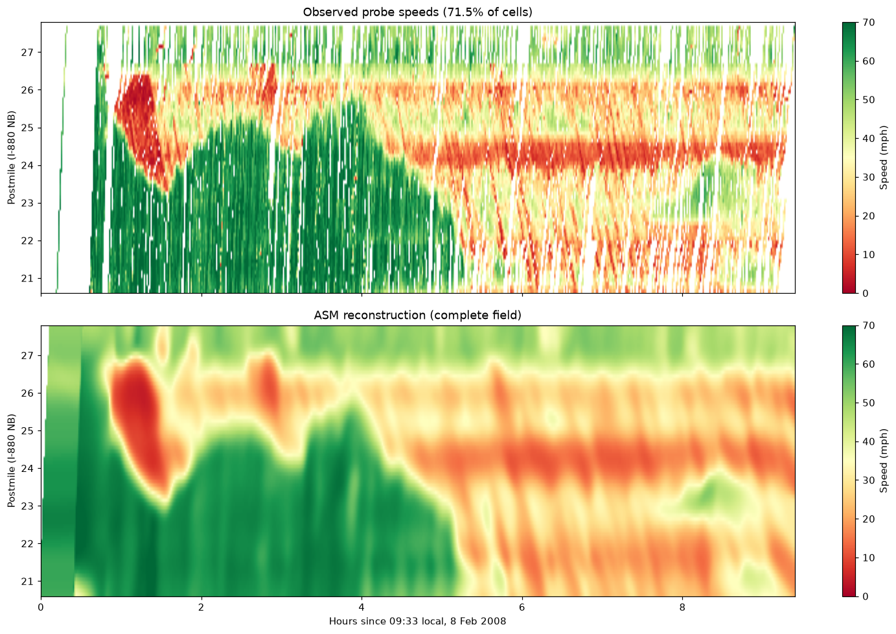
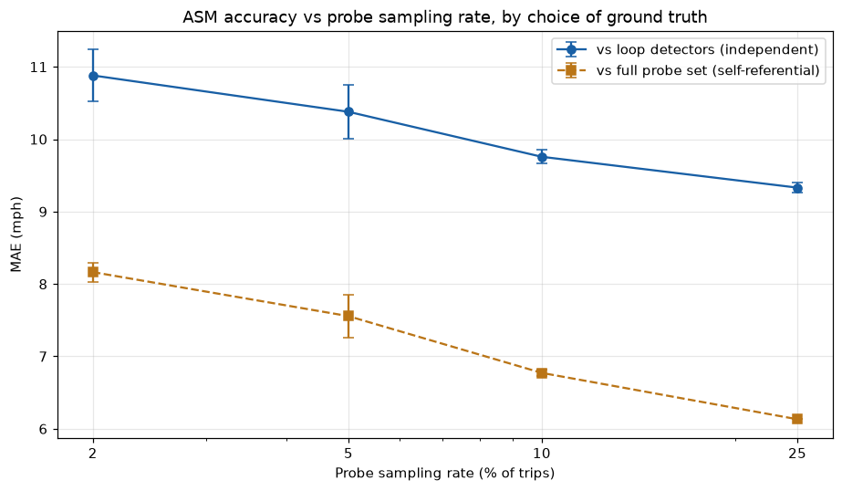

readme = '''# Traffic State Estimation from Sparse Probe Vehicles

Reconstructing the full speed field of a highway corridor from a small
fraction of GPS-equipped vehicles, validated against independent sensors.

Data: [Mobile Century](https://traffic.berkeley.edu/project/downloads/mobilecenturydata)
(UC Berkeley / Nokia, 8 February 2008) — ~100 GPS phones driven along 10 miles
of I-880 for 9 hours, with loop detectors and video cameras recording
independent ground truth.



## Findings

**1. Ground truth choice changes the conclusion.** Scored against the full
probe set, accuracy appears to improve steadily with more probes (8.2 → 6.1
mph). Scored against independent loop detectors, the same reconstructions
improve far less (10.9 → 9.3 mph). Much of the apparent gain was the
estimate agreeing better with its own input.



**2. Accuracy is remarkably insensitive to probe count.** Against loops, 27
vehicles achieve MAE 10.9 mph; 346 vehicles achieve 9.3; all 1,387 achieve
9.0. A 51-fold increase in probes buys under 2 mph.

| Rate | Trips | MAE (mph) | Corr | Bias | MAE congested | MAE free-flow |
|---|---|---|---|---|---|---|
| 2%  | 27  | 10.88 ± 0.36 | 0.76 | −4.66 | 8.01 | 12.89 |
| 5%  | 69  | 10.38 ± 0.38 | 0.78 | −4.80 | 7.24 | 12.39 |
| 10% | 138 | 9.76 ± 0.09  | 0.81 | −5.30 | 5.82 | 11.92 |
| 25% | 346 | 9.33 ± 0.07  | 0.83 | −5.54 | 4.87 | 11.34 |

**3. More probes help only in congestion.** Congested-regime error falls 39%
from 2% to 25% sampling; free-flow error falls 12%. Free-flow error is
structural, not a data-volume problem: the smoothing kernel drags narrow
free-flow bands toward adjacent congestion. A shockwave-preserving method,
not more probes, is what would improve it.

**4. Smoothing recovers signal that raw probes miss.** At full penetration
the ASM reconstruction correlates with loop detectors slightly better
(r = 0.866) than the raw probe observations it was built from (r = 0.853).
Averaging along traffic characteristics cancels GPS noise and single-vehicle
variation.

**2. Smoothing recovers signal that raw probes miss.** Against independent
loop detectors, the ASM reconstruction correlates *better* (r = 0.866) than
the raw probe observations it was built from (r = 0.853). Averaging along
traffic characteristics cancels GPS noise and single-vehicle idiosyncrasy.

**3. Kernel smoothing compresses free-flow speeds.** Scored against loops,
ASM is near-unbiased in congestion (+0.5 mph, MAE 4.5) but under-predicts
free-flow by 9.3 mph (MAE 11.4). Free-flow regions here are narrow bands
between congested ones, so the smoothing kernel drags them toward
neighbouring slow traffic. This is the specific weakness a shockwave-
preserving method would need to beat.

## Method

Probe GPS is aggregated onto a 1-minute × 0.1-mile space-time grid
(72 × 564 cells, postmile 20.6–27.8). The
[Adaptive Smoothing Method](https://doi.org/10.1016/S0191-2615(01)00043-1)
(Treiber & Helbing) fills empty cells by smoothing twice — along free-flow
characteristics (+50 mph, downstream) and congested characteristics
(−12 mph, upstream) — then blending by local congestion level.

Penetration is simulated by sampling whole **trips**, not individual points.
A real deployment has a fraction of *vehicles* reporting, each sending a full
trajectory; dropping random points would instead simulate a lossy sensor and
leave every trip partially visible — a much easier problem.

## Validation

Three independent sources, deliberately kept separate from estimator input:

- **Probe reference field** — all 1,387 northbound trips (71.5% cell coverage).
  Dense, but derived from the same data, so not independent.
- **Loop detectors** — 19 in-pavement sensors, 30-second flow and occupancy,
  converted to speed via the g-factor method. Fully independent.
- **Video travel times** — camera re-identification of individual vehicles.
  *(Not yet integrated.)*

## Limitations

- Single corridor, single day. This is a methods benchmark, not a
  generalisation claim.
- Loop speeds are derived from occupancy via an assumed effective vehicle
  length, and are known to over-read in congestion. They corroborate
  structure rather than serve as absolute truth.
- Study domain truncated to postmile 20.6–27.8: probes stopped covering the
  southern section after ~13:30, and estimating there would be fabrication.
- The sweep covers 2–25% sampling. Denser rates were not run.
- Sampling rate is the fraction of *experiment trips*, not true market
  penetration among all I-880 traffic.
- A systematic −5 mph bias persists at every sampling rate. It does not
  shrink with more data, so it reflects method error rather than sampling:
  both ASM's free-flow blurring and the g-factor's known tendency to
  over-read speed in congestion push in the same direction. The two cannot
  be separated with this data.

## Reproducing

The dataset is not redistributable — download it from the link above and set
`DATA_ROOT` in `config.py`.

```
pip install -r requirements.txt
jupyter notebook MobileCentury.ipynb
```